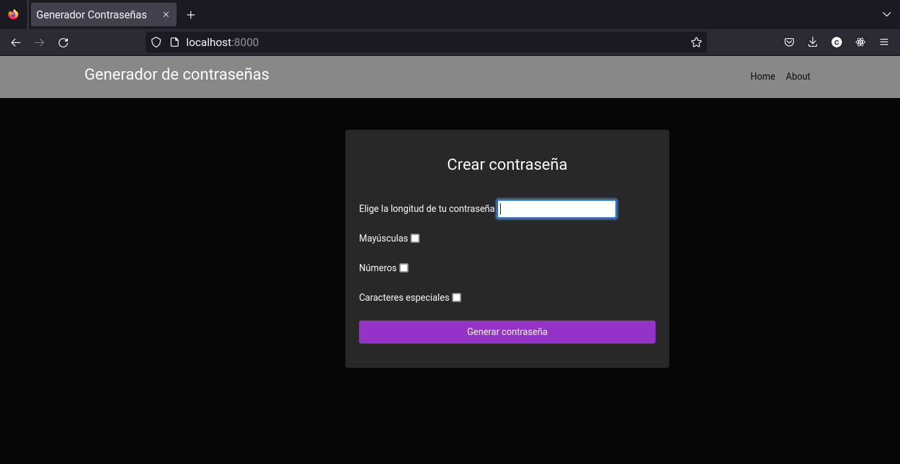
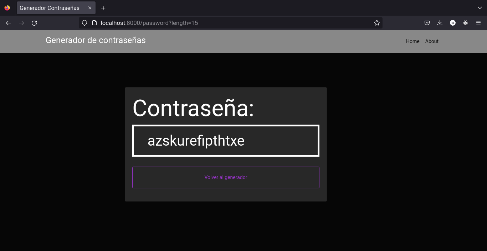

# Password-generator
## a simple password generator with django, python and boostrap

<br/>

### Screenshots
 




<br/>

___

- ### Run with docker (recommended)
```
$ docker build --tag python-django .
$ docker run --publish 8000:8000 --name python-django python-django
```

now you can visit <a href="http://localhost:8000" target="_blank" rel="noreferrer">http://localhost:8000</a>

- ### Installation

```
$ git clone https://github.com/chemokita13/password-generator_django.git
$ cd django-password-generator
$ python manage.py runserver
```

now you can visit <a href="http://localhost:8000" target="_blank" rel="noreferrer">http://localhost:8000</a>
